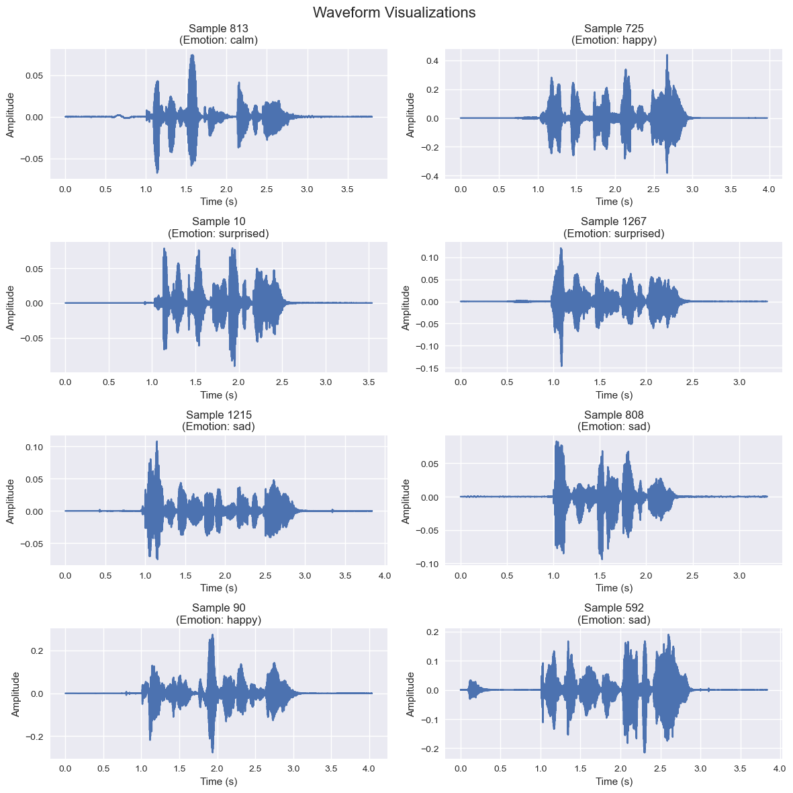

# NLP Project Collection

Welcome to my collection of Natural Language Processing (NLP) projects. This repository contains various projects exploring different facets of NLP, from text analysis and sentiment detection to language generation and beyond.

## Updated Projects

#### 1. Asynchronous OpenAI API Interaction Tutorial

This document serves as a guide for interacting with the OpenAI API asynchronously, focusing on practical examples and configurations for effective usage. It's tailored to facilitate users in environments like Jupyter Lab, emphasizing the GPT-3.5-turbo model and asynchronous execution patterns.

#### 2. BERTopic - Advanced Topic Modeling**  
BERTopic leverages state-of-the-art transformer models and class-based TF-IDF to generate dense clusters of topics for comprehensive and interpretable text analysis. This section of the repository showcases the application of BERTopic on a dataset, illustrating its capabilities in uncovering meaningful topics within large text corpora. The project emphasizes BERTopic's adaptability in handling various sizes of datasets and its efficiency in topic modeling processes.

##### Key Highlights of the BERTopic Project:
- Utilization of 🤗 transformers for generating document embeddings.
- Application of class-based TF-IDF to enhance topic specificity and relevance.
- Exploration of different topic modeling techniques supported by BERTopic.
- Visualizations of topic distributions and hierarchies for enhanced interpretability.

#### 3\. AuralSent: Harmonizing Text and Sound for Sentiment Analysis

A groundbreaking exploration into the fusion of NLP and audio processing techniques to analyze sentiments expressed in speech. This project delves into advanced audio feature extraction, including MFCCs, Chroma, Mel-Spectrogram, Spectral Contrast, and more, to detect emotions from speech data effectively. Utilizing the comprehensive RAVDESS dataset, this initiative showcases the power of combining linguistic cues with acoustic signals to enhance sentiment analysis.

##### Key Features of the AuralSent Project:

*   Advanced audio feature extraction leveraging Librosa for in-depth emotion recognition.
*   Integration of pitch, magnitude, tempo, Zero-Crossing Rate, Energy, and Spectral Entropy to capture the nuanced dynamics of speech.
*   Comparative analysis of various machine learning models to identify the most effective architecture for emotion detection.
*   Detailed exploration of the impact of different audio features on the sentiment analysis process, supported by visualizations and empirical evidence.

This collection stands as a testament to the potential of combining NLP and audio analysis to push the boundaries of how we interpret language and emotions, offering a window into the future of human-computer interaction.

[View Project](AuralSent/AuralSent.ipynb)

